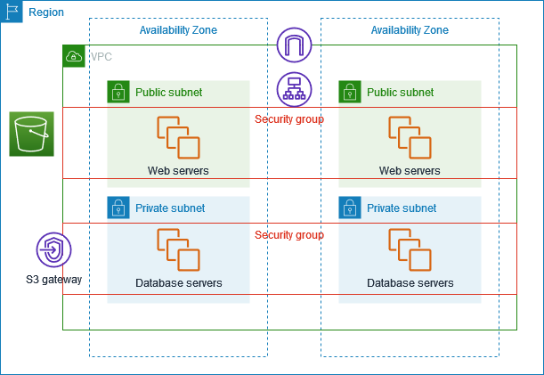

# AWS NOTES

---

## 🔐 IAM – Identity and Access Management

- IAM is used to **control access** to AWS resources
- IAM is a **global service** (no region selection)
- IAM entities:
  - **Users** – individual people or services
  - **Groups** – collection of users
  - **Roles** – assumed by AWS services (EC2, ECS, Lambda, etc.)

### Policies

- Permissions are defined using **JSON policies**
- Policies follow **least privilege principle**
- Policies can be:
  - **AWS managed**
  - **Customer managed**
  - **Inline policies**

### IAM Policy Structure

```json
{
  "Version": "2012-10-17",
  "Statement": [
    {
      "Sid": "AllowS3ReadOnlyAccess",
      "Effect": "Allow",
      "Action": ["s3:GetObject", "s3:ListBucket"],
      "Resource": [
        "arn:aws:s3:::DOC-EXAMPLE-BUCKET",
        "arn:aws:s3:::DOC-EXAMPLE-BUCKET/*"
      ]
    }
  ]
}
```

- `Effect`: Allow / Deny
- `Action`: AWS API actions
- `Resource`: ARN of resource
- Explicit **Deny always overrides Allow**

### Other Important IAM Concepts

- **IAM Roles** are preferred over access keys
- **STS (Security Token Service)** issues temporary credentials
- **MFA** should be enabled for root and privileged users
- Root user should **never** be used for daily work

💡 **Interview Tip**:

> “How does EC2 access S3 securely?”
> Answer: Using **IAM Role**, not access keys.

---

## ⚖️ ELB – Elastic Load Balancing

### Types of Load Balancers

1. **Application Load Balancer (ALB)**
   - Layer 7 (HTTP/HTTPS)
   - Path-based & host-based routing
   - Used for web apps, microservices

2. **Network Load Balancer (NLB)**
   - Layer 4 (TCP/UDP)
   - Ultra high performance & low latency
   - Static IP support

3. **Gateway Load Balancer (GLB)**
   - Used for **security appliances**
   - Traffic inspection, firewalls

### Target Groups

- Load balancer routes traffic to **target groups**
- Targets can be:
  - EC2 instances
  - IP addresses
  - ECS services
  - Lambda (ALB only)

### Listeners

- Listener defines:
  - Port (80, 443)
  - Protocol
  - Routing rules

💡 **Interview Tip**:

> ALB supports WebSockets, HTTP/2, path-based routing
> NLB does NOT support HTTP headers

---

## 🗄️ RDS – Relational Database Service

- Managed relational databases:
  - PostgreSQL
  - MySQL
  - MariaDB
  - Oracle
  - Microsoft SQL Server
  - IBM DB2
  - **Aurora**

### Aurora

- AWS proprietary DB engine
- Compatible with **MySQL & PostgreSQL**
- High performance, auto-scaling storage
- Supports **Aurora Serverless**

### High Availability & Scaling

- **Multi-AZ**: automatic failover
- **Read Replicas**: scale read traffic
- Only **one writer**, multiple readers

### Backups

- Automated backups
- Manual snapshots
- Point-in-time recovery

### ElastiCache

- Managed **Redis** and **Memcached**
- Used for:
  - Caching
  - Session storage
  - Reducing DB load

💡 **Interview Tip**:

> RDS ≠ DynamoDB (relational vs NoSQL)

---

## 🐳 ECS – Elastic Container Service

- AWS service to run **Docker containers**
- Two launch types:
  - **EC2** – you manage instances
  - **Fargate** – serverless containers

### ECS Components

- Cluster
- Task Definition
- Task
- Service

💡 **Interview Tip**:

> ECS is simpler than EKS, tightly integrated with AWS

---

## 📦 ECR – Elastic Container Registry

- Private Docker registry on AWS
- Used with ECS, EKS, EC2
- Supports:
  - Image scanning
  - IAM-based access
  - Lifecycle policies

---

## ☸️ EKS – Elastic Kubernetes Service

- Managed Kubernetes on AWS
- AWS manages:
  - Control plane
  - etcd

- You manage:
  - Worker nodes (or Fargate)

💡 **Interview Tip**:

> EKS gives portability, ECS gives simplicity

---

## 🌍 Route 53

- AWS DNS service
- Highly available and scalable
- Supports:
  - Public & private hosted zones
  - Health checks
  - Traffic routing policies

### Routing Policies

- Simple
- Weighted
- Latency-based
- Failover
- Geolocation
- Geoproximity

---

## 🚀 CloudFront

- AWS CDN (Content Delivery Network)
- Uses **edge locations** globally
- Improves:
  - Latency
  - Performance
  - Security

### Common Use Cases

- Serve static websites
- Frontend assets (JS, CSS)
- Protect ALB / API Gateway

💡 **Interview Tip**:

> CloudFront can use **S3, ALB, EC2** as origins

---

## 🌐 VPC – Virtual Private Cloud

- A **virtual network** dedicated to your AWS account
- VPC is **region-specific**
- Components:
  - Subnets
  - Route tables
  - Internet Gateway
  - NAT Gateway
  - Security Groups
  - NACL
  - VPC Flow Logs

---

### Subnets

- Subnets are **AZ-specific**
- Types:
  - **Public subnet** → route to IGW
  - **Private subnet** → no direct internet access

---

### Internet Gateway (IGW)

- Allows communication between VPC and internet
- Attached to **VPC**
- Required for public subnets

---

### NAT Gateway

- Allows **private subnet** resources to access internet
- Prevents internet from accessing private resources
- Lives in **public subnet**

---

### Route Tables

- Control how traffic is routed
- Public route table:

  ```
  0.0.0.0/0 → Internet Gateway
  ```

- Private route table:

  ```
  0.0.0.0/0 → NAT Gateway
  ```

---

### Security Groups

- Virtual firewall
- Operates at **instance level**
- **Stateful**
- Only allow rules (no deny)

---

### Network ACL (NACL)

- Operates at **subnet level**
- **Stateless**
- Supports allow & deny rules

---

### VPC Flow Logs

- Capture network traffic metadata
- Used for:
  - Debugging
  - Security analysis

---

### VPC Peering

- Connect two VPCs privately
- Traffic stays within AWS network
- No transitive peering

[]

💡 **Interview Tip**:

> VPC Peering ≠ Transit Gateway
> Transit Gateway is used for many VPCs

---

## ⭐ Final Interview Summary (Must Remember)

- IAM → Who can do what
- VPC → Network isolation
- ALB → HTTP routing
- NAT → Internet for private servers
- RDS → Managed relational DB
- ECS/EKS → Containers
- CloudFront → CDN
- Route53 → DNS

## IAM i Identity and access management

- Through policies we can give permissions to users
- IAM is a global service so no region need to be selected
- IAM policy structure

```
{
  "Version": "2012-10-17",
  "Statement": [
    {
      "Sid": "AllowS3ReadOnlyAccess",
      "Effect": "Allow",
      "Action": [
        "s3:GetObject",
        "s3:ListBucket"
      ],
      "Resource": [
        "arn:aws:s3:::DOC-EXAMPLE-BUCKET",
        "arn:aws:s3:::DOC-EXAMPLE-BUCKET/*"
      ]
    }
  ]
}
```

## ELB

- Three type of load balancer, Application load balancer, network load balancer, gatewary load balancer
- ALB- http and https
- NLB - Ultra high performance
- GLB - To analyze the traffic, it helps in improving security

#### while configuring loadbalancer we need to add the target group (security group) and include the ec2 instances in that group and assign to the listener of load balancer

## RDS

- amazon rds allow , postgres, ,mysql, mariaDB, oracle, microsoft sql, ibm db2, aurora
- Aurora is managed by aws and it support postgresSQL and MySQL, it has serverless DB as well
- RDS deployments - read replicas, writing database to only one db and read from many database
- cross AZ as a failover, also we can do multi region
- ElastiCache to managed redis

## ECS

- Elastic container service, launch docker containers on AWS

## ECR

- elastic container registry , private docker registry on aws

## Amazon EKS

- Allow you to launch managed kubernetes clusters on AWS

## Amazon Route 53

## AWS cloudfront

- CDN - hundreds of points of presence globally

## VPC

- virtual private cloud, security groups, network ACL, VOC flow logs, subnets, internet gateways and NAT gateways
- A VPC is linked to single region
- A subnets allow you to partition your network inside your vpc
- Internet gateways helps our VPC instances connect with the internet
- public subnets have a route to the internet gateway
- NAT gateways allow your instances in your private subnets to access the internet while remaining private
- Security groups - a firewall that controls traffic to and from an ec2 instance
- Security group operates at the instance level
- VPC peering , connect two VPC , privately using AWS network, make them behave as if they were in the same network

## Example of

- Frontend (FE) → calls Backend API
- Backend → talks to Database
- Backend is behind a Load Balancer
- Everything runs inside AWS VPC

Browser
↓
Internet
↓
ALB (Public Subnet)
↓
Backend EC2/ECS (Private App Subnet)
↓
RDS Database (Private DB Subnet)

                    Internet
                       ^
                       |
                 +-------------+
                 | Internet GW |
                 +-------------+
                       |
        +--------------------------------+
        |        Public Route Table      |
        | 0.0.0.0/0 → Internet Gateway  |
        +--------------------------------+
                       |
               +------------------+
               | Public Subnet    |
               |                  |
               |  +------------+  |
               |  | NAT GW     |  |
               |  +------------+  |
               +--------|---------+
                        |
        +--------------------------------+
        |       Private Route Table      |
        | 0.0.0.0/0 → NAT Gateway       |
        +--------------------------------+
                        |
              +--------------------+
              | Private App Subnet |
              | Backend Servers    |
              +--------------------+

Security Group View (Who Can Talk to Whom)

```psql
[ Internet ]
     |
     v
[ ALB SG ]
     |
     v
[ Backend SG ]
     |
     v
[ DB SG ]


Inside the VPC

+------------------------------------------------------+
|                       VPC (10.0.0.0/16)              |
|                                                      |
|  +--------------------+   +--------------------+    |
|  | Public Subnet A    |   | Public Subnet B    |    |
|  | 10.0.1.0/24        |   | 10.0.2.0/24        |    |
|  |                    |   |                    |    |
|  |  +-------------+  |   |  +-------------+  |    |
|  |  | ALB         |  |   |  | ALB         |  |    |
|  |  +-------------+  |   |  +-------------+  |    |
|  +--------|-----------+   +---------|----------+    |
|           |                         |               |
|           v                         v               |
|  +--------------------+   +--------------------+    |
|  | Private App Sub A  |   | Private App Sub B  |    |
|  | 10.0.11.0/24       |   | 10.0.12.0/24       |    |
|  |                    |   |                    |    |
|  |  +-------------+  |   |  +-------------+  |    |
|  |  | Backend EC2 |  |   |  | Backend EC2 |  |    |
|  |  +-------------+  |   |  +-------------+  |    |
|  +--------|-----------+   +---------|----------+    |
|           |                         |               |
|           v                         v               |
|  +--------------------+   +--------------------+    |
|  | Private DB Sub A   |   | Private DB Sub B   |    |
|  | 10.0.21.0/24       |   | 10.0.22.0/24       |    |
|  |                    |   |                    |    |
|  |  +-------------+  |   |  +-------------+  |    |
|  |  | RDS Primary |  |   |  | RDS Standby |  |    |
|  |  +-------------+  |   |  +-------------+  |    |
|  +--------------------+   +--------------------+    |
|                                                      |
+------------------------------------------------------+
```
