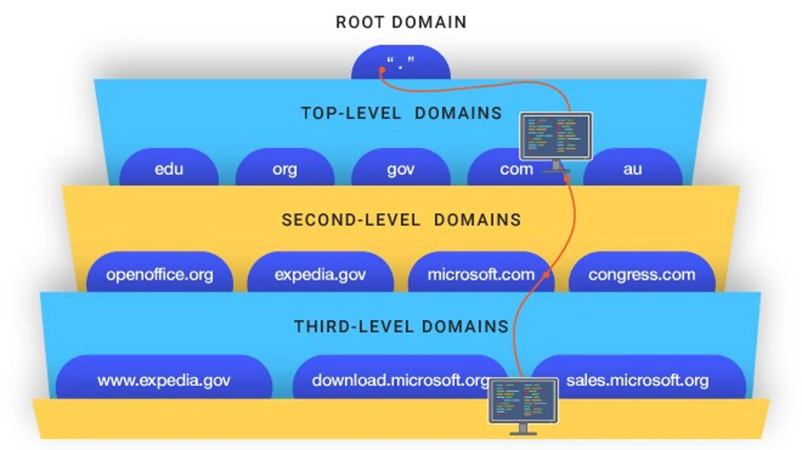

## Must read Cracking the coding interview
- https://github.com/chaudharyachint08/Self-Learning/blob/master/BOOKS/DSA%20%26%20Competitive%20Programming/Cracking-the-Coding-Interview-6th-Edition-189-Programming-Questions-and-Solutions.pdf

### 1) What happens when you type URL in the browser
There are four layers through which this domain name query goes through. Let’s understand the steps: 
1) After hitting the URL, the browser cache is checked. As browser maintains its DNS records for some amount of time for the websites you have visited earlier. Hence, firstly, DNS query runs here to find the IP address associated with the domain name
2) The second place where DNS query runs in OS cache followed by router cache.
3) If in the above steps, a DNS query does not get resolved, then it takes the help of resolver server. Resolver server is nothing but your ISP (Internet service provider). The query is sent to ISP where DNS query runs in ISP cache.
4) If in 3rd steps as well, no results found, then request sends to top or root server of the DNS hierarchy. There it never happens that it says no results found, but actually it tells, from where this information you can get. If you are searching IP address of the top level domain (.com,.net,.Gov,. org). It tells the resolver server to search TLD server (Top level domain).
5) Now, resolver asks TLD server to give IP address of our domain name. TLD stores address information of domain name. It tells the resolver to ask it to Authoritative Name server.
6) The authoritative name server is responsible for knowing everything about the domain name. Finally, resolver (ISP) gets the IP address associated with the domain name and sends it back to the browser.

Hence, if the record cannot be found locally, a full DNS resolution is conducted as follows:

- The first point of contact for a full resolution is a root server. As of the writing of this post, 1017 instances of root servers exist.

- The root server returns the IP address of the relevant top level domain server.

- The top level domain returns the IP address of the second level domain server.

- The second-level domain server contains the DNS record of the server we are looking for. The second-level domain server returns the IP address to the browser.

    - NS record (name server) - Specifies the DNS servers for your domain/subdomain.
    - MX record (mail exchange) - Specifies the mail servers for accepting messages.
    - A record (address) - Points a name to an IP address.
    - CNAME (canonical) - Points a name to another name or CNAME (example.com to www.example.com) or to an A record.

Services such as CloudFlare and Route 53 provide managed DNS services.

After getting an IP address, resolver stores it in its cache so that next time, if the same query comes then it does not have to go to all these steps again. It can now provide IP address from their cache

### 2) How symmetric and assymmetric encryption works
- https://tiptopsecurity.com/how-does-https-work-rsa-encryption-explained/

### 3) How process, threads and go routens works
- https://www.notion.so/Internals-of-goroutines-and-Channels-ab82d73925054211a2fa7e3d4a7c54a2

### 4) What is L1 & L2 cache?

### 5) What is virtual memory? Explain paging